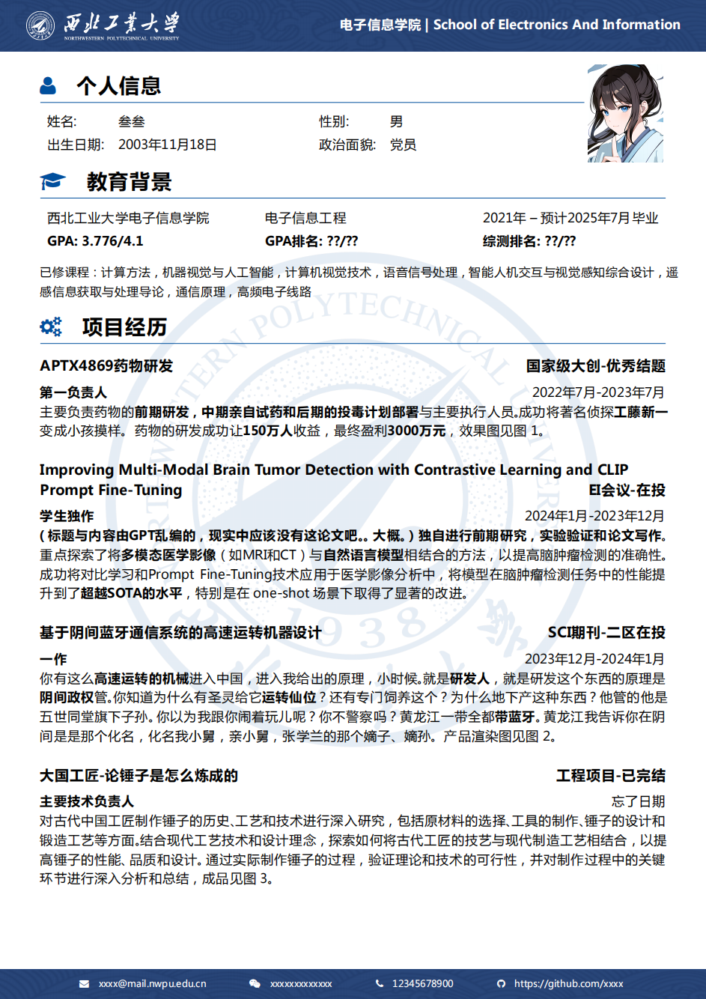
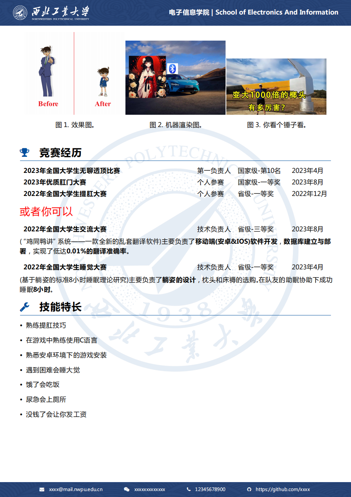

# 编译方式及注意事项

- 记得看[tex文件](./example-main.tex)开头的前言。
- 本地编译记得用`XeLaTeX*3`，即三次`XeLaTeX`进行编译，否则无法正确显示照片。（某些时候两次也可以）
- Overleaf上直接选择`XeLaTeX`即可。（左上角Menu->Settings->Compiler）

- 章节的排序可以自行更改，也可以直接删除不要的部分。
- 表格内容可自行拓展。

- LaTeX正文里出现下划线`_`记得加反斜杠转义->`\_`，例：

```latex
\newcommand{\contact}
{
    \small
    \textcolor{white}
    {
        \faWechat \quad csw209479545_3  % 错误的
        \faWechat \quad csw209479545\_3	% 正确的
    }
}
```


# 页面预览





